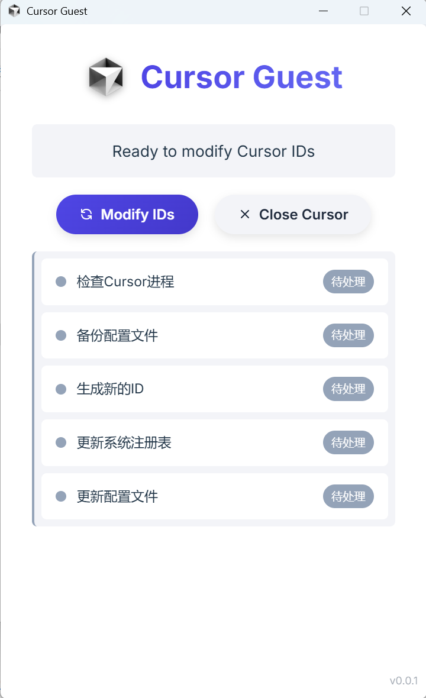

# 🚀 Cursor Guest

<div align="center">


[](#)

**让您的Cursor编辑器体验更加舒适的小工具**

</div>

## 📖 简介

Cursor Guest是通过使用Cursor编辑器，重构[go-cursor-help](https://github.com/yuaotian/go-cursor-help)项目，改为使用vite+tauri技术栈，AI开发的一个用于修改Cursor编辑器设备标识的桌面应用程序。

更多的使用帮助和说明可以前往[go-cursor-help](https://github.com/yuaotian/go-cursor-help)项目查看

## 📸 应用预览

<div align="center">
  
</div>

## ✨ 功能特点

- 🔄 关闭正在运行的Cursor进程
- 💾 备份当前Cursor配置
- 🆔 生成新的设备ID
- 🔧 更新Windows系统注册表
- 📝 更新Cursor配置文件

## 🛠️ 技术栈

- **前端**: 
  - 🌐 HTML, CSS, JavaScript
  - ⚡ Vite - 闪电般的前端构建工具

- **后端**: 
  - 🦀 Rust - 高性能系统编程语言
  - 🔧 Tauri - 构建更小、更快、更安全的桌面应用

- **核心依赖**: 
  - 🪟 winapi - Windows API 接口
  - 🎲 uuid - 通用唯一标识符生成
  - 📝 winreg - Windows 注册表操作
  - ⏰ chrono - 日期和时间功能

## 🚀 开发指南

### 📋 环境要求

- 📦 Node.js
- 🦀 Rust（需要自行安装Rust环境）
- 🔧 Tauri CLI

### 🔧 安装依赖

```bash
npm install
```

### 💻 开发模式运行

```bash
npm run tauri dev
```

### 📦 构建应用

```bash
npm run tauri build
```

## 📁 应用结构

```
src/                  # 前端源代码
├── main.js           # 前端主要逻辑
└── style.css         # 应用样式

src-tauri/           # Rust/Tauri后端代码
└── src/             # Rust源代码
    ├── main.rs      # 应用入口点
    ├── commands.rs  # Tauri命令实现
    ├── config.rs    # 配置文件操作
    ├── models.rs    # 数据模型
    ├── process.rs   # 进程管理
    ├── registry.rs  # Windows注册表操作
    └── utils.rs     # 工具函数
```

## ⚠️ 权限要求

> ⚡ 此应用需要**管理员权限**才能修改系统注册表。

## 🙏 鸣谢

Cursor Guest的开发离不开以下优秀项目的支持：

- 🔧 [go-cursor-help](https://github.com/yuaotian/go-cursor-help) - Cursor Free Trial Reset Tool
- ⚡ [tauri-apps/tauri](https://github.com/tauri-apps/tauri) - Build smaller, faster, and more secure desktop applications with a web frontend
- 🚀 [vitejs/vite](https://github.com/vitejs/vite) - Next generation frontend tooling. It's fast!